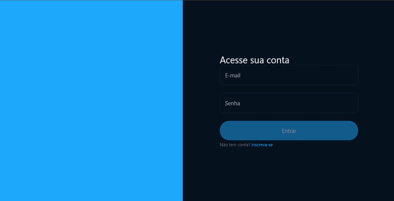

   

<h1 align="center">MiniClone do Twitter</h1>
<p align="center"> 
  
 </p>
 
 # Sumário

• [Sobre o Projeto](#-sobre-o-projeto)

• [Tecnologias utilizadas no desenvolvimento do projeto](#-tecnologias-utilizadas-no-desenvolvimento-do-projeto)

- [Como executar o projeto](#-como-executar-o-projeto)
  - [Remotamente](#Remotamente)
  - [Localmente](#localmente)

### 💻 Sobre o Projeto

<p>Este projeto é um mini clone do twitter feito durante o evento Full Stack Challenge, a aplicação esta divida em dois repositorios.</p>

<h2 align="center">Obs: o Banco de dados do projeto esta desativado, então não é possivel estar testando remotamente no momento</h2>

- **[Repositorio Web](https://github.com/andremarquezz/ProjetoTwitterWeb)**

- **[Repositorio API](https://github.com/andremarquezz/ProjetoTwitterAPI)**

### 🛠 Tecnologias utilizadas no desenvolvimento do projeto

- **[React](https://github.com/facebook/react)**
- **[React Router Dom](https://github.com/ReactTraining/react-router/tree/master/packages/react-router-dom)**
- **[TailWind](https://tailwindcss.com/)**
- **[koa](https://www.npmjs.com/package/koa)**
- **[axios](https://www.npmjs.com/package/axios)**
  > Veja outras tecnologias em [package.json](https://github.com/andremarquezz/ProjetoTwitterWeb/blob/main/package.json)

# 🚀 Como executar o projeto

### Remotamente

_Copie a URL abaixo e cole no seu navegador_

```jsx
https://minitwitter.vercel.app/
```
_É necessario fazer o cadastro e login para utilizar a aplicação._

### Localmente

_Pré-requisitos_

Antes de começar, você vai precisar ter instalado em sua máquina as seguintes ferramentas:
[Git](https://git-scm.com), [Node.js](https://nodejs.org/en/).
Além disto é bom ter um editor para trabalhar com o código como [VSCode](https://code.visualstudio.com/)

_1- Clonar o repositorio ProjetoTwitterWeb_

```jsx
git@github.com:andremarquezz/ProjetoTwitterWeb.git
```
_2- Clonar o repositorio ProjetoTwitterAPI_

```jsx
git@github.com:andremarquezz/ProjetoTwitterAPI.git
```

_2- Executar o comando abaixo no terminal, dentro da pasta de cada repositorio._

```jsx
npm install
```
_Obs: talver seja necessario rodar `npm install koa` no repositorio ProjetoTwitterAPI_

_3- Executar o comando abaixo no terminal, dentro da pasta do projeto ProjetoTwitterWeb_._

```jsx
npm run dev
```
_3- Executar o comando abaixo no terminal, dentro da pasta do projeto ProjetoTwitterAPI._

```jsx
npm start
```
_Obs: talver seja necessario rodar `npx prisma generate` no repositorio ProjetoTwitterAPI antes de npm start_

*A aplicação deve conter `.env` nos dois repositorios, você pode encontrar exemplos dentro da pasta do projeto com o nome de `.env.example`.* 
